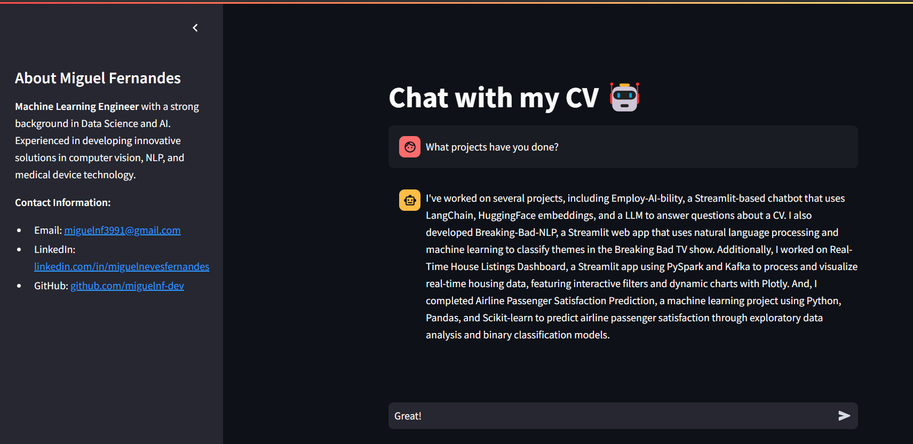

# Employ-AI-bility 🤖

Welcome to **Employ-AI-bility** – a super cool and interactive way to chat with my CV! 🚀

You can try it here : https://miguelfernandescv.streamlit.app/



## What is this?
This is a Streamlit app that turns my CV into a chatbot. Yes, you heard it right! You can ask questions about my experience, skills, and projects, and get instant answers as if you're talking to me (Miguel Fernandes) directly. It's powered by cutting-edge AI tech like LangChain, HuggingFace embeddings, and more.


## Features
- **Chat with My CV**: Ask anything about my professional journey, and the bot will respond as if it's me. 
- **AI-Powered**: Uses advanced AI to provide accurate and relevant answers.
- **Easy-to-Use Interface**: Built with Streamlit for a smooth and responsive user experience.

## Technologies Used
- **Python**
- **Streamlit**
- **LangChain & HuggingFace**: For AI-powered responses.
- **Chroma**: For efficient document retrieval.

## How to Use
1. Clone the repository.
2. Create a `.env` file in the root directory of the project and add your API key for the desired model:
    ```plaintext
    API_KEY=your_api_key_here
    ```
3. Install the required packages.
4. Run the Streamlit app and start chatting!

```bash
git clone https://github.com/miguelnf-dev/Employ-AI-bility.git
cd Employ-AI-bility
pip install -r requirements.txt
streamlit run app.py
```

## About Me
I'm Mig...
Enjoy chatting with my CV! 😄